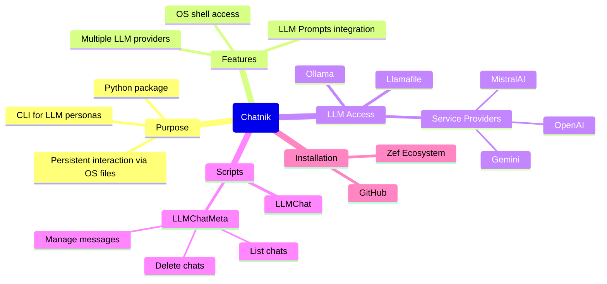
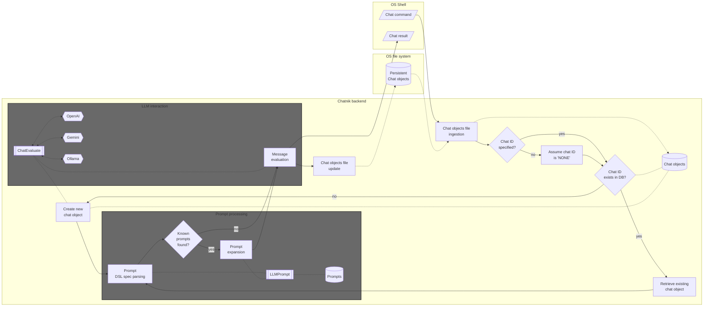
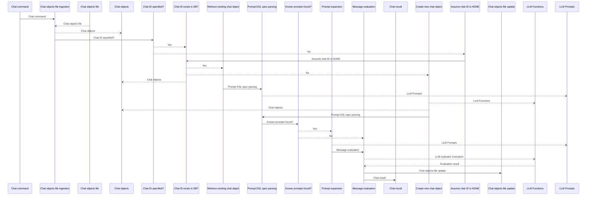

# Chatnik

Wolfram Language paclet that provides Command Line Interface (CLI) scripts for conversing with persistent Large Language Model (LLM) personas.

"Chatnik" uses files of the host Operating System (OS) to maintain persistent interaction with multiple LLM chat objects.

"Chatnik" can be seen as a package that "moves" the LLM-chat objects interaction system of the paclet ["Chatbook"](https://resources.wolframcloud.com/PacletRepository/resources/Wolfram/Chatbook), [CGp1],
into typical OS shell interaction.
(I.e. an OS shell is used instead of a Wolfram notebook.) 

There are several consequences of this approach:

- Multiple LLMs and LLM providers can be used
- The chat messages can use the provided by Wolfram Language:
  - [Prompts collection](https://resources.wolframcloud.com/PacletRepository/)
  - [Prompt spec DSL and related prompt expansion](https://writings.stephenwolfram.com/2023/06/introducing-chat-notebooks-integrating-llms-into-the-notebook-paradigm/#applying-functions-in-a-chat-notebook)
- Easy access to OS shell functionalities 

**Remark:** This Wolfram Language (WL) paclet is a translation of the Raku package ["Chatnik"](https://github.com/antononcube/Raku-Chatnik), [AAp1] 
and the Python package ["Chatnik"](https://pypi.org/project/Chatnik/), [AAp2].
The WL CLI scripts are with CamelCase, i.e. `LLMChat` and `LLMChatMeta`. 
The corresponding CLI scripts of the Raku package use kebab-case, i.e. `llm-chat` and `llm-chat-meta`.
The corresponding CLI scripts of the Python package use snake_case, i.e. `llm_chat` and `llm_chat_meta`.

**Remark:** In addition, the Raku package provides the "umbrella" CLI `chatnik`. 

----

## Installation

From [Wolfram Language Paclet Repository](https://resources.wolframcloud.com/PacletRepository/):

```
PacletInstall["AntonAntonov/Chatnik"]
```

From [Wolfram Cloud](https://www.wolframcloud.com/obj/antononcube/DeployedResources/Paclet/AntonAntonov/Chatnik/):

```
PacletInstall[ResourceObject["https://wolfr.am/1EaUfp9Tp"]]
```

----

## LLM access setup

There are several options for using LLMs with this package -- see the instructions 
in the page ["Wolfram Tools for LLM & AI Researchers"](https://www.wolfram.com/artificial-intelligence/researchers/).


----

## Basic usage examples

The prompts used in the examples are provided by the [Wolfram Prompt Repository (WPR)](https://resources.wolframcloud.com/PromptRepository/).

### A few turns chat

The script `LLMChat` is used to create and chat with LLM personas (chat objects):

1. Create _and_ chat with an LLM persona named "yoda1" (using the [Yoda chat persona](https://resources.wolframcloud.com/PromptRepository/resources/Yoda/)):

```shell
LLMChat -i=yoda1 --prompt @Yoda hi who are you
```

2. Continue the conversation with "yoda1":

```shell
LLMChat -i=yoda1 since when do you use a green light saber
```

**Remark:** The message input for `LLMChat` can be given in quotes. For example: `LLMChat 'Hi, again!' -i=yoda1`.

### Apply prompt(s) to shell pipeline output

Summarize a file using the prompt ["Summarize"](https://resources.wolframcloud.com/PromptRepository/resources/Summarize):

```shell
cat README.md | LLMChat --prompt=@Summarize
```

Summarize a file and then translate it to another language using the prompt ["Translate"](https://resources.wolframcloud.com/PromptRepository/resources/Translate):

```shell
cat README.md | LLMChat --prompt=@Summarize | LLMChat -i=rt --prompt='!Translate|Russian'
```

**Remark:** The second `LLMChat` invocation has to use different chat object identifier because the default 
chat object, with identifier "NONE", is already primed with the prompt "Summary".

-----

## Chat objects management

The CLI script `LLMChatMeta` can be used to view and manage the chat objects used by "Chatnik".
Here is its usage message:

```shell
LLMChatMeta --help
```

List all chat objects ("chats" and "personas" are synonyms to "list"):

```shell
LLMChatMeta list --format=json
```

Here we see the messages of "yoda1":

```shell
LLMChatMeta messages -i yoda1
```

Here we clear the messages:

```shell
LLMChatMeta clear -i yoda1
```


-----

## Advanced usage examples

### Asking for a result in specific format

```shell
LLMChat -i=beta --model=ollama::gemma3:12b 'What are the populations of the Brazilian states? #NothingElse|"JSON data frame"' 
```

### Make a request, echo, and place in clipboard  

```
LLMChat -i=unix '@CodeWriterX|Shell macOS list of files echo the result and copy to clipboard.' | tee /dev/tty | pbcopy
```
```
#  ls | tee >(pbcopy) 
```

**Remark:** Instead of `... | tee /dev/tty | pbcopy` the pipeline command `... | tee >(pbcopy)` can be also used.

### Make a mind-map of a file

Consider the task of making an (LLM derived) mind map over a certain document. (Say, this REDME.)
There are several ways to do that.

#### 1

1. Put file's content to be the positional input argument 
2. Use the prompt ["MermaidDiagram"](https://resources.wolframcloud.com/PromptRepository/resources/MermaidDiagram/) in `--prompt`

```
LLMChat -i=mmd "$(cat README.md)" --model=ollama::gemma4:26b --prompt=@MermaidDiagram
```

#### 2

1. Put file's content to be the positional input argument
2. Expand the prompt "manually" via `LLMPrompt` provided by "Chatnik".

```
LLMChat -i=mmd "$(cat README.md)" --model=ollama::gemma4:26b --prompt="$(llm_prompt 'MermaidDiagram'  below)"
```

**Remark:** This example shows another computation result can be used as a prompt. 
I.e. no need to rely on the automatic prompt expansion.

#### 3

1. Give the prompt ["MermaidDiagram"](https://resources.wolframcloud.com/PromptRepository/resources/MermaidDiagram/) as input
2. Put file's content to be the value of `--prompt`
   - Put additional prompting for further interaction 

```
LLMChat -i=mmd @MermaidDiagram --model=ollama::gemma4:26b --prompt="FOCUS TEXT START:: $(cat README.md) ::END OF FOCUS TEXT. If it is not clear which text to use, use FOCUS TEXT."
```

This command allows to do further tasks with the file content as context. For example:

```
LLMChat -i=mmd '!ThinkingHatsFeedback'
```

#### Result

The commands above produce results similar to this diagram:



### Render Markdown results with dedicated programs

Get feedback on a text with the prompt ["ThinkingHatsFeedback"](https://resources.wolframcloud.com/PromptRepository/resources/ThinkingHatsFeedback):

```
cat README.md | LLMChat -i=th --prompt="$(llm-prompt ThinkingHatsFeedback 'the TEXT is GIVEN BELOW.' --format=Markdown)" --model=ollama::gemma4:26b 
```

**Remark:** By default the prompt "ThinkingHatsFeedback" gives the hat-feedback table in JSON format.
(Currently) the prompt expansion does not handle named parameters, hence, 
`llm-prompt` is used to specify the Markdown format for that table.   

Get the LLM (chat object) answer -- via `LLMChatMeta` -- put into a temporary file and "system open" that file:

```
tmpfile="$TMPDIR/llmans.md"; LLMChatMeta -i=th last-message > "$tmpfile"; open "$tmpfile"
```

The command above works on macOS. On Linux instead of explicitly creating a file in the temporary dictory,
the argument `--suffix` can be passed to `mktemp`. For example:

```
tmpfile=$(mktemp --suffix=".md"); LLMChatMeta -i=th last-message > "$tmpfile"; open "$tmpfile"
```

### Tabulate the LLM personas summary

If the text browser [`w3m`](https://w3m.sourceforge.net) and the Raku package ["Data::Translators"](https://raku.land/zef:antononcube/Data::Translators) are installed,
the following pipeline can be used to tabulate the summary the LLM personas:

```shell
LLMChatMeta list --format=json | data-translation | w3m -T text/html -dump -cols 120
```

-----

## Customization

### Default model

Default model can be specified with the env variable `CHATNIK_DEFAULT_MODEL`. For example:

```
export CHATNIK_DEFAULT_MODEL=ollama::gemma4:26b
```

Remove with `unset CHATNIK_DEFAULT_MODEL`. 

### Pre-defined LLM personas

Use defined LLM personas are specified with JSON file with a content like this:

```json
[
    {
	"chat-id": "raku",
	"conf": "ChatGPT",
	"prompt": "@CodeWriterX|Raku",
	"model": "gpt-4o",
	"max-tokens": 4096,
	"temperature": 0.4
    }
]
```

(See such a file [here](https://github.com/antononcube/Raku-Jupyter-Chatbook/blob/master/resources/llm-personas.json).)

The LLM personas JSON file can be specified with the OS environmental variable 
`CHATNIK_LLM_PERSONAS_CONF`.

To load the predefined LLM personas use the command:

```
LLMChatMeta load-llm-personas
```

**Remark:** Snake_case and CamelCase CLI commands are also allowed, e.g., `LLMChatMeta LoadLLMPersonas`.

-----

## Implementation details

### Architectural design

Here is a flowchart that describes the interaction between the host Operating System and chat objects database:




Here is the corresponding UML Sequence diagram:



### Persistent chat objects

Keeping the persistent chat objects database is a fairly straightforward using the 
[Wolfram Language persistent values system](https://reference.wolfram.com/language/guide/SettingPersistentValues.html). 
Efficiency considerations for "using the WL and OS to manage the database" are probably can not that important 
because LLMs invocation is (much) slower in comparison.


----
## References

## Articles, blog posts

[AA1] Anton Antonov,
["Chatnik: LLM Host in the Shell — Part 1: First Examples & Design Principles"](https://rakuforprediction.wordpress.com/2026/04/25/chatnik-llm-host-in-the-shell-part-1-first-examples-design-principles/),
(2026),
[RakuForPrediction at WordPress](https://rakuforprediction.wordpress.com).

### Packages

[AAp1] Anton Antonov,
[LLMFunctionObjects, Python package](https://github.com/antononcube/Python-packages/tree/main/LLMFunctionObjects),
(2023-2026),
[GitHub/antononcube](https://github.com/antononcube).
([PyPI.org page](https://pypi.org/project/LLMFunctionObjects).)

[AAp2] Anton Antonov,
[LLMPrompts, Python package](https://github.com/antononcube/Python-packages/tree/main/LLMPrompts),
(2023-2025),
[GitHub/antononcube](https://github.com/antononcube).
([PyPI.org page](https://pypi.org/project/LLMPrompts).)

[AAp3] Anton Antonov,
[JupyterChatbook, Python package](https://github.com/antononcube/Python-JupyterChatbook),
(2023-2026),
[GitHub/antononcube](https://github.com/antononcube).
([PyPI.org page](https://pypi.org/project/JupyterChatbook).)

[AAp4] Anton Antonov,
[Chatnik, Raku package](https://github.com/antononcube/Raku-Chatnik),
(2026),
[GitHub/antononcube](https://github.com/antononcube).